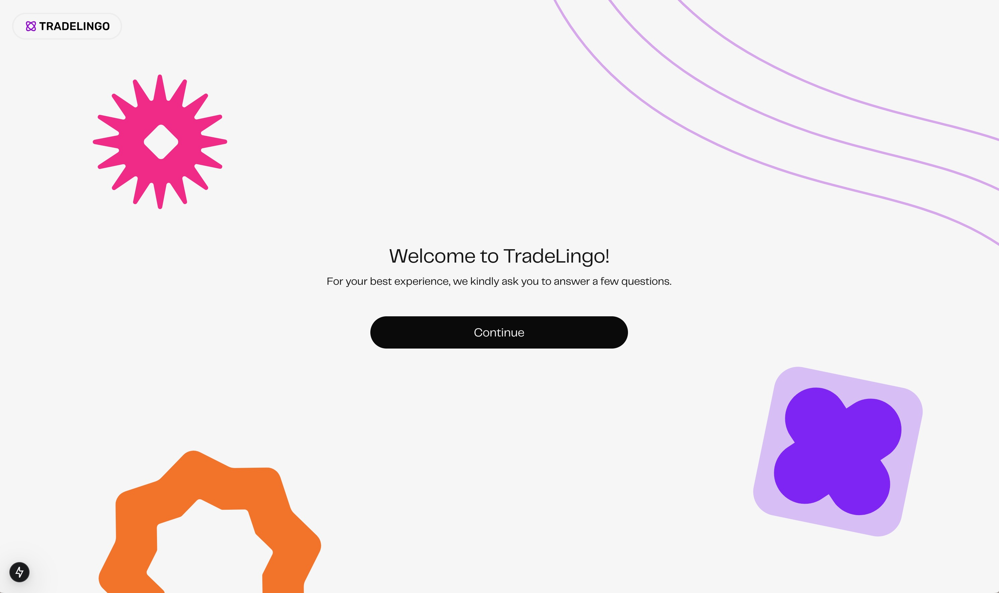
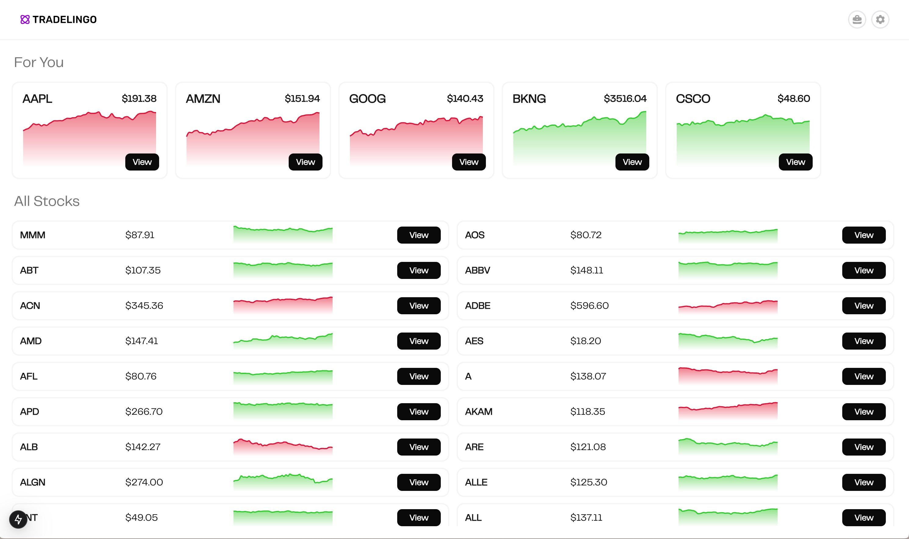
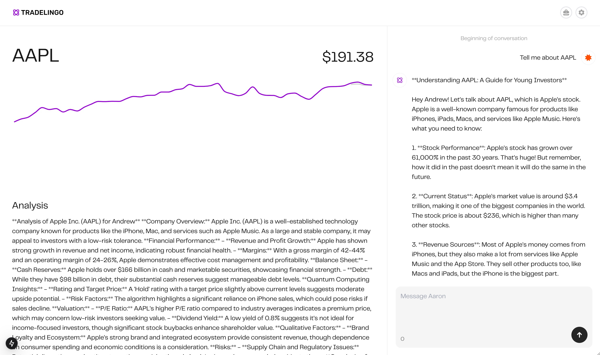
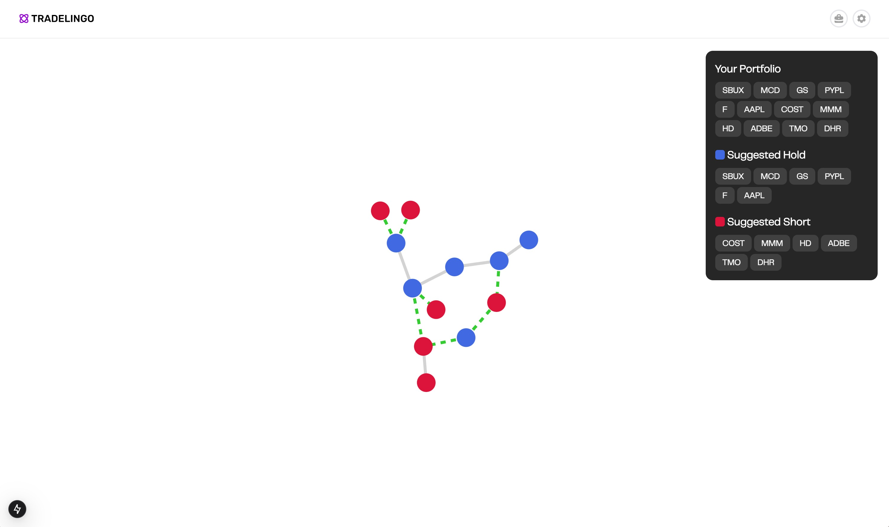

<p align="center">
  
</p>

# Tradelingo: Hedge Fund at Your Fingertip

## Overview  
Tradelingo is an AI-powered financial intelligence platform that leverages **quantum computing and deep learning** to provide highly accurate stock market predictions and risk assessments.  

The financial market is notoriously difficult to navigate, with **95% of retail investors losing money** due to lack of high-quality insights and access to expert-level analysis. Many existing financial platforms charge excessive fees, such as **Robinhood Gold’s $1,000/year premium service**, and provide reports that are lengthy, complex, and difficult for the average investor to interpret. Additionally, financial education in traditional institutions is outdated, leaving students without the necessary experience to make informed investment decisions.  

Tradelingo is designed to solve these problems by democratizing access to **Wall Street-grade intelligence** through cutting-edge technology. Our platform provides real-time **market insights, risk assessments, and personalized investment recommendations**, making advanced trading strategies accessible to **everyone—from beginners to seasoned investors**.  

---
## Demo Video

Click the thumbnail below to watch the full demo on YouTube!

<p align="center">
  <a href="https://youtu.be/QYAdLLu-XSc?feature=shared">
    
  </a>
</p>

---
## Key Features

### Dashboard & User Information  
An intuitive and interactive dashboard that provides users with a comprehensive overview of essential metrics. The user information section offers personalized insights, ensuring a tailored experience based on individual preferences and activities.

<p align="center">
  
  
</p>


### Stock Prediction & Information Integration  
Leverage advanced machine learning algorithms for precise stock predictions. This feature delivers data-driven forecasts alongside a well-structured summary of crucial stock information, empowering users to make informed investment decisions.

<p align="center">
  
  
</p>


### Portfolio Optimization  
A sophisticated portfolio optimization tool designed to maximize returns while minimizing risk. Utilizing cutting-edge optimization techniques, it provides actionable recommendations for achieving optimal asset allocation tailored to the user's financial goals.

<p align="center">
  
</p>

---

## Features  

- **Quantum Machine Learning for High-Accuracy Predictions**  
  Our proprietary quantum-enhanced models achieve **97.3% accuracy**, significantly outperforming traditional financial prediction models.  

- **Personalized Investment Insights**  
  Tradelingo generates **customized reports and investment strategies** based on a user’s experience level, financial goals, and risk tolerance.  

- **Real-Time Market Analysis**  
  By integrating **DeepSeek AI** and **Alpha Vantage**, the platform continuously analyzes live market data, identifies emerging trends, and delivers actionable recommendations.  

- **AI-Driven Risk Management**  
  Using **Topological Data Analysis (TDA)** and **Min-Cut Max-Flow algorithms**, Tradelingo evaluates the stability of financial assets, helping users manage risk more effectively.  

- **Accessibility for All Investors**  
  The platform is designed with a user-friendly interface, making advanced financial analysis available to **students, retirees, and professional investors alike**.  

---
## Mathematical Foundations of the Model

### 🔍 1. Quantum Time Series Analysis with QTDA + QPE

#### Quantum Time Series Data Analysis (QTDA)
QTDA provides a framework for encoding time series data into quantum states to analyze temporal correlations. To efficiently capture underlying patterns and remove noise, the **Quantum Fourier Transform (QFT)** is employed.

**Mathematical Definition of QFT:**

The QFT is defined as:

$$
\text{QFT} : |x\rangle \mapsto \frac{1}{\sqrt{N}} \sum_{k=0}^{N-1} e^{\frac{2\pi i x k}{N}} |k\rangle
$$

where:  
- $|x\rangle$ is the input state,  
- $N = 2^n$ represents the Hilbert space dimension for $n$ qubits.

The QFT transforms the time-domain signal into its frequency-domain representation, enabling effective periodicity detection and data smoothing.


####  Quantum Phase Estimation (QPE)
QPE is used for extracting eigenvalues from unitary operators, which plays a critical role in forecasting time series data.

**Mathematical Principle of QPE:**

Given a unitary operator $U$ with eigenvector $|\psi\rangle$ and eigenvalue $e^{2\pi i \theta}$:

$$
U |\psi\rangle = e^{2\pi i \theta} |\psi\rangle
$$

The QPE algorithm estimates the phase $\theta$, which is directly related to key predictive components of the data.

**Key Steps in QPE:**
1. Prepare the initial state:  
   $$
   |0\rangle^{\otimes t} |\psi\rangle
   $$
2. Apply Hadamard gates:  
   $$
   H^{\otimes t}
   $$
3. Perform controlled-unitary operations:  
   $$
   U^{2^j}
   $$
4. Apply the inverse QFT and measure to approximate $\theta$.

### 2. Quantum Graph Algorithm for the Max-Cut Problem

The Max-Cut problem aims to partition a graph $G = (V, E)$ into two sets such that the sum of the weights of edges crossing the partition is maximized.

#### Mathematical Formulation:

Max-Cut can be formulated as the following binary optimization problem:

$$
\max \sum_{(i,j) \in E} w_{ij} \frac{1 - x_i x_j}{2}
$$

where:  
- $x_i \in \{-1, 1\}$ indicates the subset assignment for vertex $i$.  
- $w_{ij}$ denotes the weight of edge $(i, j)$.

---

#### Quantum Approximate Optimization Algorithm (QAOA)

To solve the Max-Cut problem efficiently, we use the **QAOA**, which combines quantum circuits and classical optimization loops.

**QAOA State Preparation:**

$$
|\gamma, \beta\rangle = \prod_{l=1}^{p} e^{-i \beta_l H_M} e^{-i \gamma_l H_C} |+\rangle^{\otimes n}
$$

where:  
- $H_C$ is the **Cost Hamiltonian** corresponding to the Max-Cut problem:

$$
H_C = \sum_{(i,j) \in E} \frac{1}{2}(1 - Z_i Z_j)
$$

- $H_M$ is the **Mixing Hamiltonian**:

$$
H_M = \sum_{i} X_i
$$

The parameters $\gamma_l$ and $\beta_l$ are optimized using classical methods to maximize the expected value of $H_C$.


### 3. Portfolio Optimization via Quantum Max-Cut Results

The Max-Cut solution is leveraged for portfolio optimization by identifying optimal asset groupings that balance return and risk.

#### Mathematical Formulation:  
The classical **Markowitz Mean-Variance Model** for portfolio optimization is given by:

$$
\min_{w} \left( w^T \Sigma w \right) \quad \text{subject to} \quad \sum_{i} w_i = 1, \quad w_i \geq 0
$$

where:  
- $w$ is the weight vector representing asset allocations.  
- $\Sigma$ is the covariance matrix of asset returns.


#### Integration with Max-Cut Results

To incorporate insights from the Max-Cut solution, we modify the optimization problem as follows:

$$
\min_{w} \left( w^T (\Sigma + \alpha L) w \right)
$$

where:  
- $L$ is the **Laplacian matrix** derived from the graph structure obtained through the Max-Cut solution.  
- $\alpha$ is a hyperparameter controlling the trade-off between expected return and risk diversification.

---
## Performance Comparison  

| Metric | Traditional Model | Tradelingo (Quantum-Enhanced) |
|--------|------------------|-------------------------------|
| **Prediction Time** | 1.01s | 0.17s (Over 10x Faster) |
| **Prediction Accuracy** | 83% | 97.3% (+16.5% Improvement) |

The integration of **quantum computing** enables faster computations, making real-time investment decision-making far more efficient.

---

## Technology Stack  

| Component | Technologies Used |
|-----------|------------------|
| **Frontend** | Next.js, Tailwind CSS |
| **Backend**  | FastAPI, OpenAI, Groq, Alpha Vantage, YouTube Data API |
| **Database** | Elastic Search |
| **AI/ML**    | PyTorch, TensorFlow, Qiskit |
| **Algorithms** | Quantum Computing, Topological Data Analysis, Max-Cut, Min-Cut Max-Flow, NLP |

---

## Development Process  

### **1. Data Collection and Processing**  
- We aggregated **historical stock market data**, **news sentiment analysis**, and **real-time financial trends** using Alpha Vantage and DeepSeek AI.  
- Market reports were **preprocessed and structured** using **NLP models** to extract relevant information.  

### **2. Quantum Model Implementation**  
- We trained **quantum-enhanced machine learning models** for financial prediction using **Qiskit and hybrid quantum-classical techniques**.  
- The models **encoded financial features into quantum states**, enabling efficient pattern recognition.  

### **3. AI-Powered Investment Strategy Optimization**  
- We implemented **topological data analysis** to detect market anomalies.  
- The **Min-Cut Max-Flow algorithm** was used to assess risk and minimize losses in volatile conditions.  

### **4. Backend and API Development**  
- We built an **API layer with FastAPI** to handle requests for stock predictions and risk assessments.  
- Data pipelines were structured for **real-time data retrieval and analysis**.  

### **5. Frontend & User Experience Design**  
- The platform was designed with **a clean and intuitive UI** using Next.js and Tailwind CSS.  
- Users can **customize their reports** and receive investment insights tailored to their needs.  

---

## Challenges Faced  

### **Quantum AI Integration**  
- **Problem:** Applying **quantum computing** to stock market predictions required handling **noisy financial data** efficiently.  
- **Solution:** We **optimized Quantum Embedding + Hybrid ML** to enhance the model’s accuracy and stability.  

### **Ensuring Model Explainability**  
- **Problem:** Many AI-based investment platforms operate as **black boxes**, making it difficult for users to trust predictions.  
- **Solution:** We integrated **SHAP & LIME** to provide interpretable explanations of AI-generated insights.  

### **Making Advanced Financial Tools Accessible**  
- **Problem:** Most financial intelligence platforms are either **too expensive or too complex** for everyday users.  
- **Solution:** Tradelingo was designed with **simple, clear visualizations** and **customized learning experiences** to bridge the accessibility gap.  

---

## Achievements  

- Developed a **fully functional AI-powered trading platform** within **36 hours** at TreeHacks 2025.  
- Achieved **97.3% prediction accuracy** using quantum-enhanced machine learning models.  
- Successfully integrated **real-time financial data APIs** for continuous market trend analysis.  
- Built a system that makes **high-quality stock analysis affordable and accessible** to all users.  

---

## Future Plans  

- **Expanding Market Coverage**: Extending AI predictions to include **cryptocurrencies, forex, and commodity markets**.  
- **Mobile Application**: Developing **iOS and Android** versions for seamless access.  
- **AI-Powered Sentiment Analysis**: Integrating real-time **news & social media analysis** to predict market fluctuations.  
- **Institutional Partnerships**: Collaborating with financial education programs to provide **hands-on learning tools** for students.  

---

## Installation Steps

To install the required packages, run the following command in your terminal:

```bash
pip install -r requirements.txt
``` 

--- 


--- 
## Meet the Team  

| Name | University |
|------|------|
| **Quynh Anh** | Stanford University |
| **Andrew** | University of Washington | 
| **Luca** | De Anza College |
| **Aaron Kim** | Purdue Univeristy|